# ​​Dynamic Portfolio v3

<!-- Badges -->

[](https://dotnet.microsoft.com/)
[](https://learn.microsoft.com/en-us/aspnet/core)
[](https://umbraco.com/)
[](https://react.dev/)
[](https://vitejs.dev/)
[](https://learn.microsoft.com/en-us/azure/azure-sql/)
[](https://learn.microsoft.com/en-us/azure/storage/blobs/storage-blobs-introduction)

---

## 📖 Intro  

This is the **third iteration** of my portfolio site. 

It now acts as a **frontend (React + Vite)** for my other project [Dynamic Portfolio v3 - Backend](https://github.com/filip-io/Portfolio-Umbraco-Headless/). This means that my portfolio now gets its content from my **backend built with Umbraco CMS 16** using its **Content Delivery API**, hosted on **Azure as a Web App**.

---

<!-- Tech Stack Banner -->
<p align="center">

</p>

---

## ​🌐 Live Demo

🔗 [Visit my Portfolio](https://filip-io.github.io/Portfolio-Umbraco-React/)

&nbsp;

## 🛠️ Tech Stack  

### 🖥️ Frontend  
- ⚛️ **Framework:** [React 18](https://react.dev/)  
- ⚡ **Build Tool:** [Vite](https://vitejs.dev/)  
- 🌍 **Routing:** [React Router v6](https://reactrouter.com/)  
- 🎨 **Styling / Icons:** [Devicon](https://devicon.dev/)  
- 🚀 **Deployment:** [GitHub Pages](https://pages.github.com/)  

&nbsp;
### 🏗️ Backend  
- 🟣 **Platform:** [ASP.NET Core (.NET 9)](https://dotnet.microsoft.com/)  
- 🧩 **CMS:** [Umbraco CMS 16](https://umbraco.com/)  
- 🔑 **Headless API:** Umbraco Content Delivery API, hosted as Azure Web App
- ☁️ **Storage:**  
  - Azure Blob Storage (media + ImageSharp caching)  
  - Azure SQL Database (content & configuration)  
- ⚙️ **Configuration:**  
  - Wide-open **CORS** for local development  
  - Restricted **CORS** for production (only GitHub Pages origin)  
- 📦 **Packages:**  
  - `Umbraco.Cms` (core CMS)  
  - `Umbraco.StorageProviders.AzureBlob` (media storage)  
  - `Umbraco.StorageProviders.AzureBlob.ImageSharp` (image cache)  
  - `uSync` (configuration & content sync) 

&nbsp;

## ✨ Features  

- Dynamic portfolio content pulled from **Umbraco CMS**  
- Deployed frontend on **GitHub Pages**  
- Media files stored efficiently in **Azure Blob Storage**  
- Content & configuration stored in **Azure SQL Database**  
- Configurable via **Umbraco Backoffice**

&nbsp;

## 📦 Installation & Setup  

### Frontend (React + Vite)  
```bash
# clone repo
git clone https://github.com/filip-io/Portfolio-Umbraco-React.git
cd Portfolio-Umbraco-React

# install dependencies
npm install

# start dev server
npm run dev

# build for production
npm run build

# deploy to GitHub Pages
npm run deploy

```
&nbsp;

## 🏛️ Architecture diagram

```mermaid
flowchart TD
    A[🖥️ Frontend - React + Vite] --> B[🌐 Umbraco API - .NET 9]
    B --> C[☁️ Azure SQL Database]
    B --> D[☁️ Azure Blob Storage]
```



&nbsp;

## 🐣 Easter Egg Clues 🐇  

- Click on the author of the portfolio.  
- Type the name of *The One* on the **Home** screen.